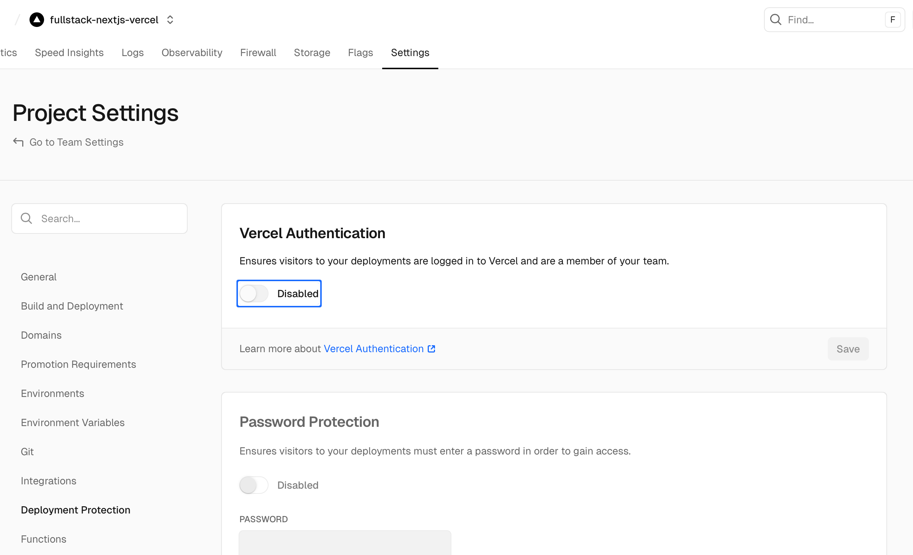

# Layercode × Next.js Example

This app demonstrates how to wire a Layercode real-time agent into a modern Next.js project. It showcases:

- Microphone selection powered by the shared `MicrophoneSelect` component.
- Speaking indicators that react to `userSpeaking` / `agentSpeaking`.
- Streaming transcripts rendered live with partial user-turn updates.
- Server-side message history stored in Vercel KV (with an automatic in-memory fallback for local dev).

## Prerequisites

- Node.js 18+ and npm.
- A Layercode agent plus API key + webhook secret.
- OpenAI (and optionally Google Generative AI) API keys for tool calls.
- A Vercel KV database if you want persistent message history in production.

By default the example pulls `@layercode/react-sdk` from npm. If you need to work against a local checkout, update `package.json` to point the dependency at your sibling `layercode-react-sdk` folder instead.

## Setup

```bash
cd fullstack-nextjs-vercel
npm install
cp .env.example .env.local
```

Fill in `.env.local` with the keys listed below, then run `npm run dev` to start the local server on http://localhost:3000.

## Environment variables

| Variable | Description |
| --- | --- |
| `NEXT_PUBLIC_LAYERCODE_AGENT_ID` | The agent to connect to from the browser (safe to expose). |
| `LAYERCODE_API_KEY` | Used by `/api/authorize` to request websocket credentials. |
| `LAYERCODE_WEBHOOK_SECRET` | Used to verify webhook calls hitting `/api/agent`. |
| `OPENAI_API_KEY` | Required for the default `gpt-4o-mini` text generation. |
| `GOOGLE_GENERATIVE_AI_API_KEY` | Optional; only needed if your agent/tools rely on it. |
| `KV_REST_API_URL`, `KV_REST_API_TOKEN`, `KV_REST_API_READ_ONLY_TOKEN`, `KV_URL` | Provided by Vercel KV. If omitted, the app falls back to an in-memory map that resets on every server restart (good enough for local testing). |

> Tip: keep `.env.local` out of version control; Next.js will load it automatically in dev.

## Message history storage

`app/api/agent/route.ts` persists every user/assistant exchange. When `KV_*` env vars are present we use `@vercel/kv` with a 12‑hour TTL per conversation. If they are missing we log a warning and store messages in-memory so local testing still works.

## Authorize route

`app/api/authorize/route.ts` proxies the browser request to `https://api.layercode.com/v1/agents/web/authorize_session` using your `LAYERCODE_API_KEY`. Customize this handler if you want to run auth checks or tweak the request payload, but keep the API key server-side.

## Running locally

```bash
npm run dev    # starts Next.js with live reload
```

The UI exposes connect/disconnect, mic mute, speaking indicators, and the reusable `<MicrophoneSelect>` component from the React SDK.

## Deploying to Vercel

1. Add all environment variables (including the KV ones) in your Vercel project settings.
2. **Disable Vercel Authentication** so Layercode webhooks can reach `/api/agent`:
   - Go to *Settings → Deployment Protection*.
   - Turn off **Vercel Authentication** and save.
3. Deploy as usual (`vercel deploy` or via Git).



You can monitor webhook deliveries in the Layercode dashboard to confirm everything is wired correctly.
